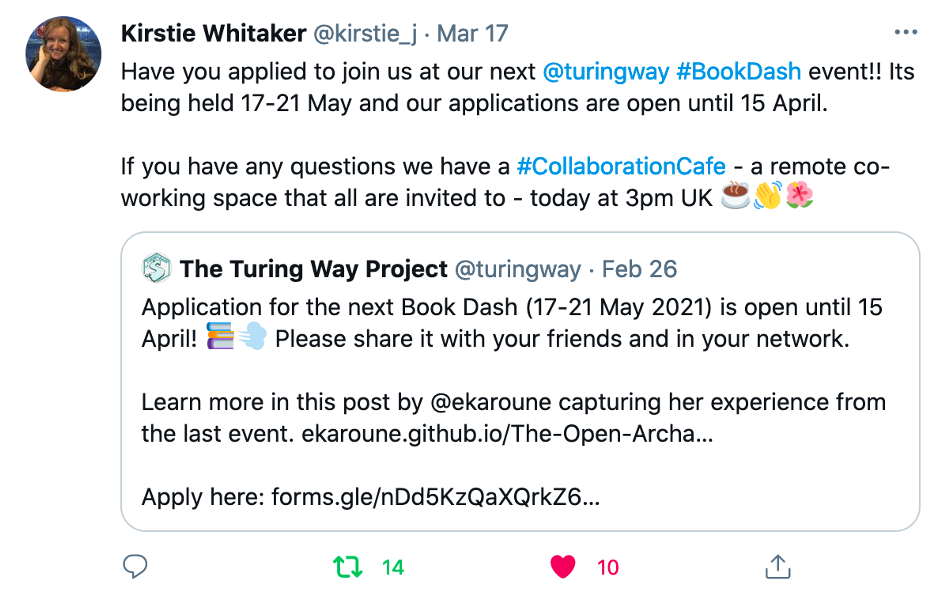
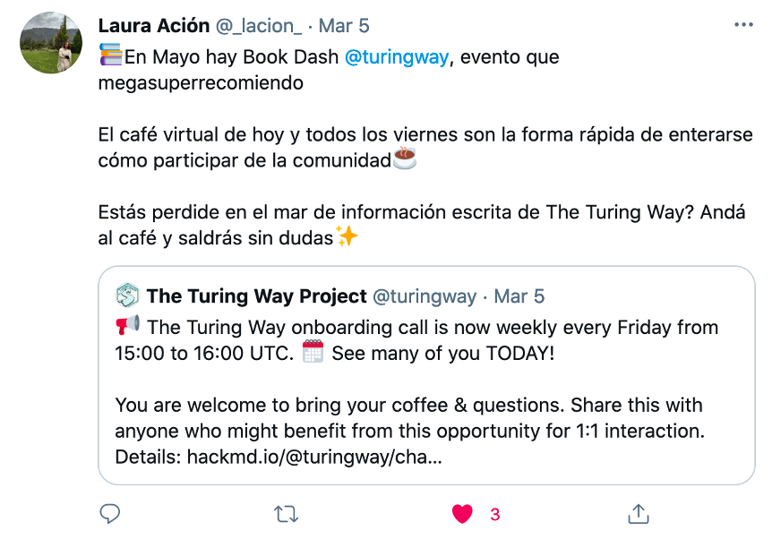
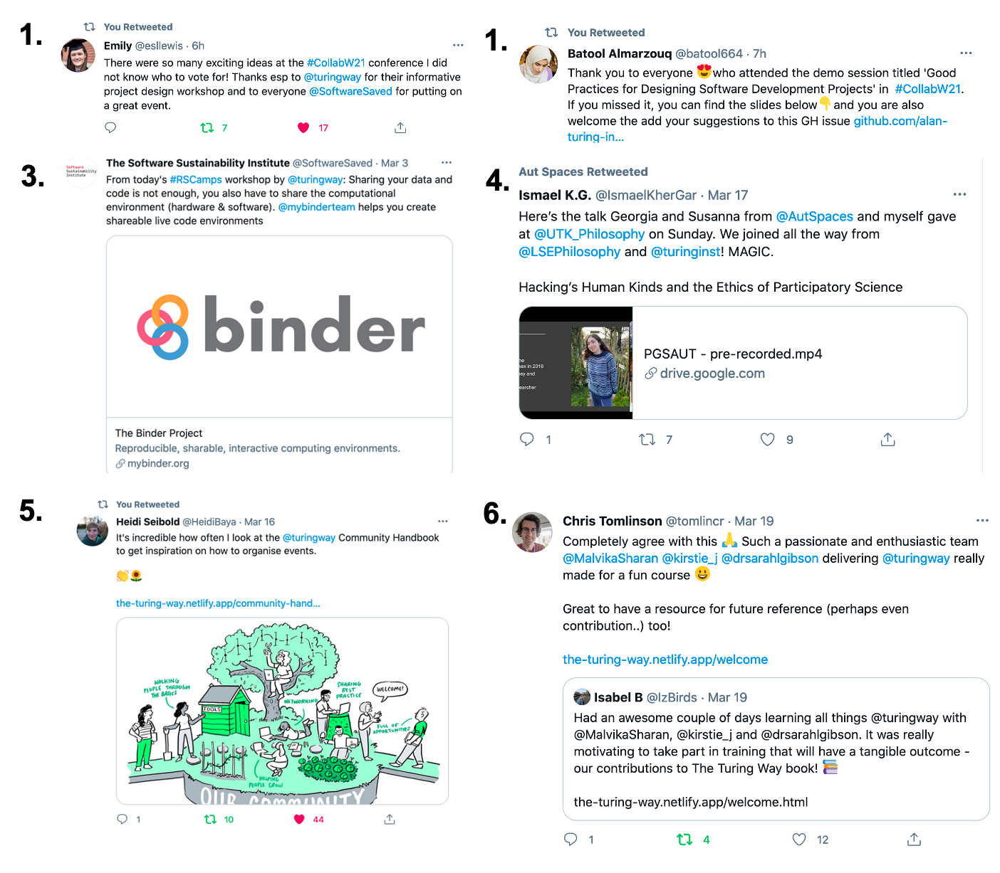

The Turing Way Newsletter: 31 March 2021

# Call for application for the upcoming Book Dash, GSoC 2021 proposal and new community resources

Hello Turing Way friends!

We hope you all are keeping well as we enter the second quarter of the year! 😇 

In this newsletter we highlight:
📚 Call for application to the [upcoming Book Dash](https://forms.gle/nDd5KzQaXQrkZ6Hn8) (17-21 May) - deadline is 15 April 2021.
☀ Proposal ideas from [Google Summer of Code (GSoC)](https://github.com/alan-turing-institute/the-turing-way/issues/1787) candidates are welcome.
🏗 Learn about open source projects building upon _The Turing Way_.
🥁 Shout out to many community members for delivering talks, workshops and discussions at various events. 

Spring wishes from _The Turing Way_ community.  🌸

Find more details on these topics below 👇

## Community Meetings

### Join the upcoming Book Dash event: 17 - 21 May 2021

*[Kirstie Whitaker tweeting ](https://twitter.com/kirstie_j/status/1372105545646276611?s=20
) to invite applications, and joining Collaboration Cafes to clarify  questions.*

Applications can be submitted until 15 April 2021 by responding to [this online form](https://forms.gle/nDd5KzQaXQrkZ6Hn8).
We have also provided a [template document](https://tinyurl.com/tw-bookdash-template) to help you work on your draft version locally.
It will likely take 30-45 minutes to prepare your application.
Successful participants will be provided with a budget to pay for any accessibility and participation related requirements including subsistence cost. 
You can see details in this [report from the last Book Dash](https://github.com/alan-turing-institute/the-turing-way/blob/master/workshops/book-dash/book-dash-nov20-report.md).
We invite our previous attendees to join to mentor a new participant at one of the sessions.

### Regular community calls

**Collaboration Cafes** are taking place on 07 April (first Wednesday) and 21 April (third Wednesday) 2021 from 15:00 - 17:00 GMT ([See in your timezone](https://arewemeetingyet.com/London/2021-04-07/15:00)). 
You can find more details in this shared document: https://hackmd.io/@turingway/collaboration-cafe. 

**Co-working Calls** are taking place in East time zones on Monday from 11:00 to 12:00 GMT  ([next call in your timezone](https://arewemeetingyet.com/London/2021-04-05/11:00)) and in West time zones on Wednesdays from 15:00 to 16:00 GMT ([next call in your timezone](https://arewemeetingyet.com/London/2021-04-14/15:00)), when Collaboration Cafés are not scheduled. 
Please find the dates and connection details for the upcoming calls: https://hackmd.io/@turingway/coworking-call. 

**Onboarding calls** will continue to take place on Fridays from 15:00 to 16:00 GMT ([next call in your timezone](https://arewemeetingyet.com/London/2021-04-09/15:00)) . 
Please read more details on this shared HackMD: https://hackmd.io/@turingway/chat-onboard.
Please sign-up to join one of the upcoming calls.
You are also welcome to lead one of these sessions. 
Please get in touch with the team members to express your interest (email: theturingway@gmail.com).

*[Laura Acion tweeting](https://twitter.com/_lacion_/status/1367833771249184774?s=20
) about The Turing Way onboarding call in Spanish to invite members to learn about the project.*

## News from the community

### Google Summer of Code (GSoC) 2021 participation

_The Turing Way_ is accepting proposals from interested student developers to write their GSoC application to work on the project.
You can find details on [GitHub issue](https://github.com/alan-turing-institute/the-turing-way/issues/1787) and [Neurostars](https://neurostars.org/t/gsoc-2021-project-idea-15-1-the-turing-way-a-how-to-guide-to-data-science/18168/6).

### New chapters

**FAIR principles**: Thanks to Esther Plomp, Emma Karoune and Ismael Kherroubi-Garcia for writing and reviewing the [chapter on FAIR principles](https://the-turing-way.netlify.app/reproducible-research/rdm/rdm-fair.html).

**Research Activism**: Laura Carter, Arielle Bennett-Lovell and Asha Titus co-wrote the first draft of the chapter [Activism in Research](https://the-turing-way.netlify.app/ethical-research/activism.html), and they invite contributions by adding case studies and examples from your work.

*Image by Scriberia and The Turing Way community from a previous Book Dash, Zenodo. http://doi.org/10.5281/zenodo.4323154.*

**Request for Review**: We have several chapters currently waiting to be reviewed in the [Pull Requests](https://github.com/alan-turing-institute/the-turing-way/pulls).
Specifically, we invite you to comment on the draft chapter on [Ways to Enter _The Turing Way_](https://github.com/alan-turing-institute/the-turing-way/pull/1736), [Research outreach](https://github.com/alan-turing-institute/the-turing-way/pull/1709), [Leadership in Data Science](https://github.com/alan-turing-institute/the-turing-way/pull/1553).
Many small edits have been made by new contributors, which are ideal places to start if you want to test your reviewing skills on GitHub.

## Relevant resources

### Projects building upon _The Turing Way_

We keep learning about Open Source projects that are built upon the project model of _The Turing Way_.
Below, we are highlighting some of those projects.

- UK Government Analytical Community. (2020). Quality assurance of code for analysis and research (version 2021.3). Office for National Statistics, Best Practice and Impact division: https://best-practice-and-impact.github.io/qa-of-code-guidance/

- A Citizen Science Guide for Research Libraries, From the LIBER Citizen Science Working Group. https://github.com/CitSci-WG/guide.

- Turing Data Stories. Beavan, D., Rangel Smith, C., Van Stroud, S. and Xu K. Turing Data Stories, 2020. https://github.com/alan-turing-institute/TuringDataStories.

- FAIR Cookbook, https://fairplus.github.io/the-fair-cookbook, Rocca-Serra, P. (University of Oxford) Sansone, S. A., (University of Oxford) Splendiani, A., (Novartis) Giessman, R. (Bayer AG) and FAIRplus Consortium Members

*If you have been developing your project up on The Turing Way in any capacity, we would love to learn and share your work with our community members.*

### Citation and References

- Culina, A., van den Berg, I., Evans, S., & Sánchez-Tójar, A. (2020). Low availability of code in ecology: A call for urgent action. PLoS Biol., 18(7), e3000763. DOI: [10.1371/journal.pbio.3000763](https://journals.plos.org/plosbiology/article?id=10.1371/journal.pbio.3000763). 
- Research Data Management 1 day workshop (Version 1). El-Gebali, Sara. (2021, February), Zenodo. http://doi.org/10.5281/zenodo.4562630. 
- Peikert, A., & Brandmaier, A. M. (2020). A Reproducible Data Analysis Workflow with R Markdown, Git, Make, and Docker. PsyArXiv. DOI: 10.31234/osf.io/8xzqy
- [Data science boosts Trusts' ability to manage ambulance demand](https://www.miragenews.com/data-science-boosts-trusts-ability-to-manage-526301). (2021, March 11).
- [Data collection tips and resources](https://think.f1000research.com/wp-content/uploads/2021/01/Data-collection-tips-and-resources-1.pdf), Wellcome Open Research. 
- Fair-AI - [Fair Artificial Intelligence in Education](https://www.fair-ai.com/project-update-3/),  Nemorin, S.
-  The [Certificate in Reproducible Research](https://biometrie.charite.de/en/teaching_and_training/certificate_reproducible_research) is a joint study program of Charité - Universitätsmedizin Berlin.

## Acknowledgements and celebrations

## Contributor in focus: Batool Almarzouq

Batool Almarzouq has a PhD in bioinformatics from University of Liverpool and has extensive experience in pharmacology, biochemistry and structural biology. 
She is the founder of R-Ladies in Saudi Arabia (Dammam) and is currently developing a local network for increasing open science awareness. 
She enjoys applying deep learning to answer biological questions and supports infrastructure-related aspects in The Turing Way.
Batool has become a part of our core contributing team ever since she participated in the Book Dash in November 2020, she shares:
> “This was such an amazing experience. It helped me to develop my technical skills. Thank you so much to everyone I met in this Book Dash event.”

### Updates from Collaboration Workshop 2021

Many _The Turing Way_ community members attended the Collaboration Workshop 2021 this week.
Chaired by Rachael Ainsworth, the Software Sustainability Institute team members managed to create yet another exciting and engaging virtual unconference.
We especially recommend watching the keynotes by  Michelle Barker and Chonnettia Jones ([video](https://www.youtube.com/watch?v=8viA4y1pz_8&feature=youtu.be)), and panel discussion chaired by Becca Wilson ([video](https://twitter.com/hashtag/CollabW21?src=hashtag_click&f=live)).
 
You can get the latest update from the event [under Twitter hashtag #CollabW21](https://twitter.com/hashtag/CollabW21?src=hashtag_click&f=live).
Some of our highlights involving The Turing Way members are the following:

* Arielle Bennett-Lovell presented a lightning talk inviting contributions to the [Activism chapter](https://the-turing-way.netlify.app/ethical-research/activism.html) in the Guide of Ethical Research.
* Emma Karoune, Batool Almarzouq and Malvika Sharan hosted a short workshop demonstrating the online book, specifically highlighting our plans for the Guide for Project Design.
They invite your contributions under [issue #1837](https://github.com/alan-turing-institute/the-turing-way/issues/1837).
* Yo Yehudi, Arielle Bennett-Lovell, Laura Carter and Malvika Sharan were part of winning teams for scoping Collaborative Ideas for the hack day.
* Aida Mehonic, Esther Plomp, Jez Cope, Laura Carter, Patricia Herterich and Sarah Gibson contributed to different projects on Hack Day.

### Recent Workshops

* Sarah Gibson, Emma Karoune, Martina G. Vilas and Sophia Batchelor delivered a workshop at the Research Software Camp hosted by the Software Sustainability Institute on 2 March 2021.
You can find the slides on Zenodo: https://zenodo.org/record/4573146.
They also wrote a summary that is available online on the [SSI blog page](https://www.software.ac.uk/top-tips-making-most-out-binder)

*Illustration by SSI from the Research Software Camps 2021*

* Kirstie, Malvika and Sarah delivered a 2-day workshop on reproducibility, open science, collaboration and communication for the graduate students in The Alan Turing Institute.
All slides are available on Zenodo: [DOI: 10.5281/zenodo.4623778](Zenodo. http://doi.org/10.5281/zenodo.4623778).

* Batool Almarzouq, Emma Karoune and Malvika Sharan hosted a workshop at the Collaboration Workshop 2021 under the title ‘Good Practices for Designing Software Development Projects (The Turing Way)’. 
The presentation with discussion prompts are available on Zenodo: [DOI: 10.5281/zenodo.4650221](https://zenodo.org/record/4650221).

### Presentations and Talks

* Sarah Gibson presented two talks on Binder at the ReproHack event on 09 March 2021 (Zenodo. http://doi.org/10.5281/zenodo.4581098) and for the COMPUTE research school at Lund University on 22 March 2021 (Zenodo: http://doi.org/10.5281/zenodo.4625924).

* On 2 March 2021, Malvika presented a talk at Open Research - A vision for the future hosted by the RIOT Club, under the title “Ten arguments against open science that you can win”. (http://doi.org/10.5281/zenodo.4572985).

* On 24 March 2021, she discussed the open source community-building aspects of _The Turing Way_ at the [Reproducible Analytical Pipeline champions network](https://gss.civilservice.gov.uk/about-us/champion-networks/reproducible-analytical-pipeline-rap-champions/) meetup (http://doi.org/10.5281/zenodo.4633118), and participated in a [DORA webinar](https://sfdora.org/2021/03/08/dora-community-call-overcoming-obstacles-to-align-research-assessment-with-community-values/) discussing assessment challenges related to contributions to research reproducibility and open science (http://doi.org/10.5281/zenodo.4633185).

### Twitter Mentions

***1** [Tweet by Emily Lewis](https://twitter.com/esllewis/status/1377272258926886914?s=20) about the CW21 workshop about The Turing Way she attended. 
**2** [Tweet by Batool Almarzouq](https://twitter.com/batool664/status/1377268574381817857?s=20), who was co-facilitator of CW21 workshop.
**3** [Tweet by SSI](https://twitter.com/SoftwareSaved/status/1367069862611271681?s=20) about the Binder workshop delivered by The Turing Way team during Research Software Camp 2021.
**4** [Tweet by Ismael Kherroubi Garcia](https://twitter.com/IsmaelKherGar/status/1372267464537513988?s=20) about a presentation he gave with the [AutSpaces](DOI 10.5281/zenodo.4603091) team.
**5** [Tweet by Heidi Siebold](https://twitter.com/HeidiBaya/status/1371834579925995521?s=20) highlighting the usefulness of our community handbook.
**6** [Chris Tomlinson quote Tweeting Isabel Birds tweet](https://twitter.com/tomlincr/status/1372964297928810499?s=20) about The Turing Way workshop they attended.*

## Connect with us!

- [About the project](https://www.turing.ac.uk/research/research-projects/turing-way-handbook-reproducible-data-science)
- [_The Turing Way_ book](https://the-turing-way.netlify.com)
- [GitHub repository](https://github.com/alan-turing-institute/the-turing-way)
- [Gitter chat room](https://gitter.im/alan-turing-institute/the-turing-way)
- [YouTube Videos](https://www.youtube.com/channel/UCPDxZv5BMzAw0mPobCbMNuA)
- [Twitter Channel](https://twitter.com/turingway)

You are welcome to contribute content for the next newsletter by
emailing [Malvika Sharan](mailto:msharan@turing.ac.uk).

*Did you miss the last newsletters?*
*Check them out [here](https://tinyletter.com/TuringWay/archive).*
